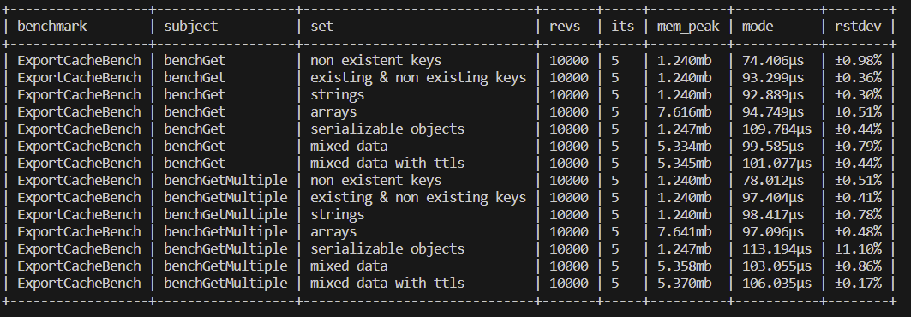
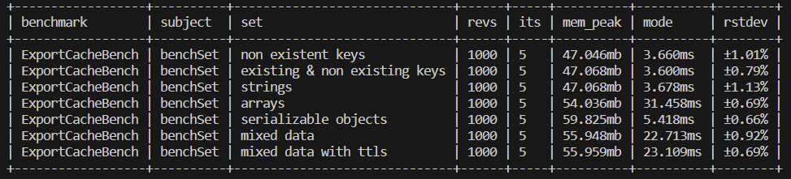

# MiMatus\ExportCache
**PSR-6 Cache without deserialization speeded-up with OPcache**

This cache package aim to target small niche use-cases when deserialization of stored data can have significant performance impact and when data stored in cache are updated rarely (or never, mainly because of write [performance](#performance)).


## 🛠 Installation
```bash
composer require mimatus/export-cache
```
It's highly recommanded to enable OPcache for best [performance](#performance)

## Usage
### Use when ...
- [OPcache](https://www.php.net/manual/en/book.OPcache.php) is enabled
- cached data are rarely changing (too frequent changes might lead to periodical reset of the OPcache memory)
- needs cache shared by PHP processes

### Don't use when...
- basically in any other use-case which is not in [Use when ... section](#use-when) 😅


### Example

```php
use MiMatus\ExportCache\ExportCache;

$storagePath = sys_get_temp_dir() . \DIRECTORY_SEPARATOR . 'export-cache';
$cache = new ExportCache($storagePath);
$closure = function () {
    return 'data'
};


$cache->set('key0', 'data', new DateInterval('P1D'));
$cache->set('key1', ['data']);
$cache->set('key2', $closure);
$cache->set('key3', 'expired data', new DateInterval('P1S'));

sleep(2);

assert($cache->get('key0') === 'data');
assert($cache->get('key1') === ['data']);
assert($cache->get('key2')() === 'data');
assert($cache->get('key3') === null);

```

### Data limitations
Thanks to [brick/varexporter](https://github.com/brick/varexporter) which is used for data serialization, it's possible to cache almost any PHP value, even closures, however with some [limitations](https://github.com/brick/varexporter#limitations):  
- PHP Internal objects - SplFileInfo, XMLReader, etc.
- objects with circular references
- annonymous classes
- eval()'d or same line declared Closures, [more info](https://github.com/brick/varexporter#caveats)

## Concurrency
- [x] Dirty Reads
- [x] Lost Updates
- [x] Phantom read
- [ ] Non-repeatable Reads - WIP

## Performance - WIP 

<details><summary>Read</summary>
    
</details>
<details><summary>Write</summary>
    
</details>  

To see full results use:  
```bash
make build
make benchmark
```
`Requires: docker`

## 💌 Credits
- serialization - [brick/varexporter](https://github.com/brick/varexporter)

## Similar projects
- [Symfony's PHPFileAdapter](https://github.com/symfony/cache/blob/6.3/Adapter/PhpFilesAdapter.php)
